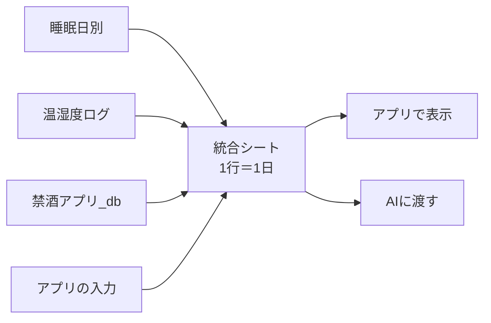

# sleep-app

睡眠の記録をまとめて、アプリで見て、AI に助言をもらうための個人用アプリ。

## できること（予定）

| 機能 | 中身 |
|---|---|
| 睡眠データの自動取り込み | Sleep Meister → ヘルスケア → iPhone ショートカット → スプシ（**稼働中**） |
| 毎朝の入力 | 中途覚醒回数・自己評価・耳栓/アイマスク/エアコン/サプリ |
| 今週の取り組み | 例：耳栓を導入 |
| 1 日 1 行の統合シート | 睡眠・室温・飲酒・入力をまとめる（AI に渡す用） |
| AI の助言 | 「AI用にコピー」→ AI に貼る → 助言をアプリに貼って表示 |

## しくみ

## フォルダ

| 場所 | 中身 |
|---|---|
| `docs/handoff.md` | 引き継ぎ書（仕様・データ設計・決定事項のすべて） |
| `gas/Code.gs` | Apps Script に貼るコードの控え |
| `CLAUDE.md` | Claude Code 用のルール |

## 状態

- ✅ 睡眠データの自動連携
- ⬜ 統合シート
- ⬜ アプリ画面
