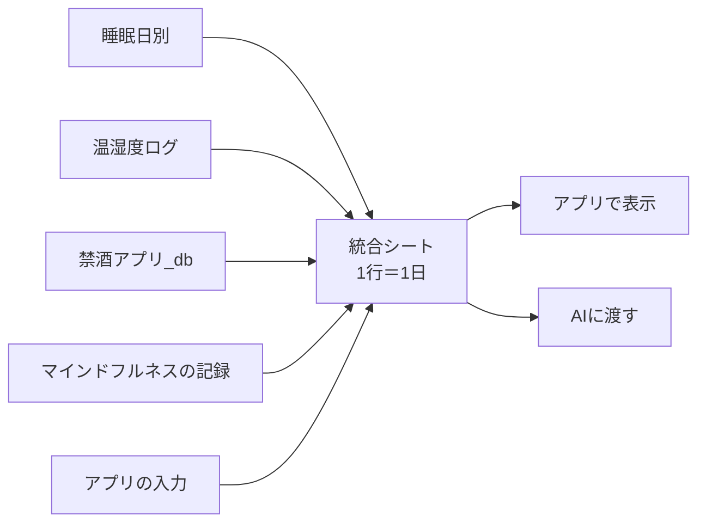

# sleep-app

睡眠の記録をまとめて、アプリで見て、AI に助言をもらうための個人用アプリ。

## できること

| 機能 | 中身 | 状態 |
|---|---|---|
| 睡眠データの自動取り込み | Sleep Meister → ヘルスケア → iPhone ショートカット → スプシ | ✅ 稼働中 |
| 毎朝の入力 | 中途覚醒回数・寝起きの気分・昨夜使ったもの（項目は追加できる） | コード作成済み |
| 1 日 1 行の統合シート | 睡眠・室温・飲酒・瞑想・気分・入力をまとめる（AI に渡す用） | コード作成済み |
| 今週の取り組み | 例：耳栓を導入 | コード作成済み |
| AI の助言 | 「AI用にコピー」→ AI に貼る → 助言をアプリに貼って表示 | コード作成済み |
| 傾向（グラフ） | 棒グラフ＋その夜に使ったものの点（案A）。あり／なしの比較表つき | コード作成済み |

## しくみ

## フォルダ

| 場所 | 中身 |
|---|---|
| `index.html` | アプリ本体（GitHub Pages で公開する） |
| `apple-touch-icon.png` | iPhone のホーム画面のアイコン |
| `gas/Code.gs` | Apps Script に貼るコードの控え（受付係＋統合係＋アプリの窓口） |
| `docs/handoff.md` | 引き継ぎ書（仕様・データ設計・決定事項のすべて） |
| `CLAUDE.md` | Claude Code 用のルール |

## はじめて動かすまで（本人の作業）

画面のボタン名などは、確認できていないものは書いていません。迷ったら、その画面のスクショを Claude に送ってください。

1. [x] **禁酒アプリ_db の共有を「制限付き」にする**（リポジトリを公開する前に必ず。理由は `docs/handoff.md` 11-3）
2. [x] **GAS を新しいコードにする**
   1. 「睡眠データ」スプシにひもづいた Apps Script（プロジェクト名「睡眠」）を開く
   2. 今のコードを全部消して、`gas/Code.gs` の中身を丸ごと貼り付けて保存する
   3. 関数 `setup` を 1 回だけ実行する（初回は Google の許可の画面が出る）
   4. スプシに「入力」「週の記録」「助言」「項目の説明」「統合」のタブができ、「統合」に 1 日 1 行で並んでいれば OK
3. [x] **デプロイを新バージョンにする**（「デプロイを管理」から。**「新しいデプロイ」は使わない**。URL が変わってショートカットが動かなくなる）
   - そのあと iPhone のショートカット「睡眠送る」を ▶️ で実行し、`OK: …日分を更新` と出れば受付係は今までどおり
4. [x] **GitHub で公開する**：PR をマージ → リポジトリを公開 → GitHub Pages を有効にする
   - 公開先：https://mitsu545.github.io/-sleep-app/
5. [ ] **iPhone で使い始める**
   1. Safari で上の GitHub Pages の URL を開く
   2. 「設定」に GAS のウェブアプリ URL（ショートカット「睡眠送る」に入っているものと同じ）を入れて保存
   3. ホーム画面に追加する

## 状態

- ✅ 睡眠データの自動連携
- ✅ GAS（統合係・アプリの窓口）／GitHub Pages 公開：2026-09-26 完了
- 🟡 アプリ画面（ホーム／入力／傾向／週の記録／設定）：iPhone での確認はこれから
- ✅ 2 回目以降は前回の表示をすぐ出し、最新を裏で取りに行く（読み込み待ちを減らす）
