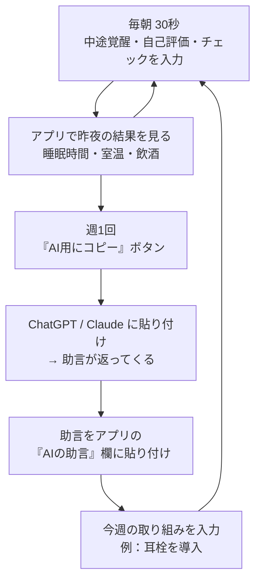
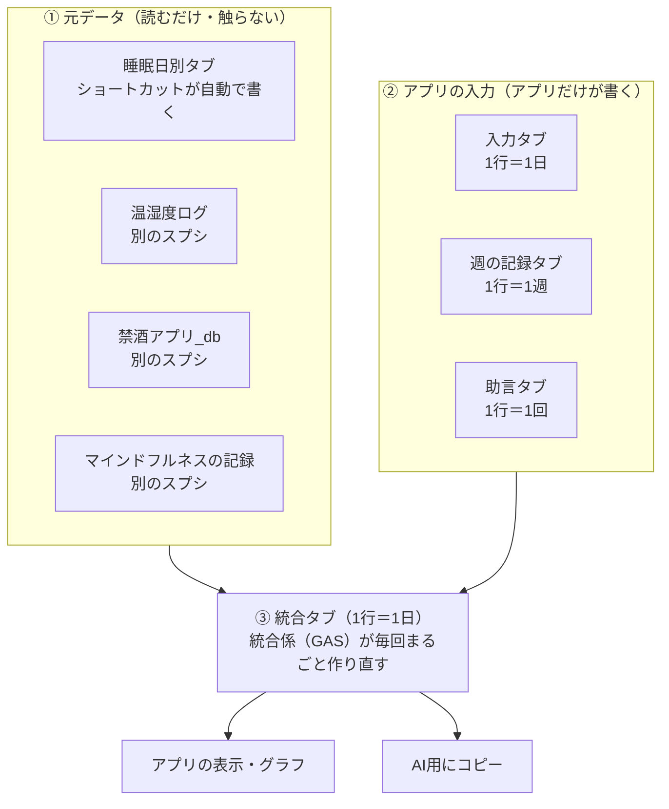
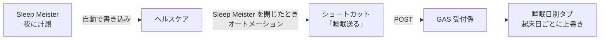

# 睡眠アプリ 引き継ぎ書

- 作成日：2026-09-26（my-workspace での壁打ち・基盤づくりの記録）
- 引き継ぎ先：このリポジトリ `sleep-app`（アプリ化ワークスペース）
- 使い方：新しいセッションの最初に「docs/handoff.md を読んで」と伝える
- 元ファイル：my-workspace の `docs/ideas/2026-09-26_睡眠アプリ引き継ぎ書.md`
- 更新：2026-09-26 sleep-app で未決定リストをすべて決定、要確認リストを一部確認（[11 章](#11-未決定要確認リスト)）
- 更新：2026-09-26 デザイン案（傾向は案A）・マインドフルネスの記録を追加。MVP① のコード（`index.html`・`gas/Code.gs`）を作成。本人の作業は [11-5](#11-5-本人の作業次にやること)

> ⚠️ の付いた箇所は、実物で確認できていない推測です。作業前に必ず確認すること。

---

## 目次

1. [目的](#1-目的)
2. [決まったこと・決まっていないこと](#2-決まったこと決まっていないこと)
3. [全体構成](#3-全体構成)
4. [完成済みの基盤：睡眠データの自動連携](#4-完成済みの基盤睡眠データの自動連携)
5. [データソースの詳細](#5-データソースの詳細)
6. [アプリの仕様](#6-アプリの仕様)
7. [データ設計（スプシのタブと列）](#7-データ設計スプシのタブと列)
8. [技術構成と注意点](#8-技術構成と注意点)
9. [実装の進め方（MVP）](#9-実装の進め方mvp)
10. [新リポの初期構成と CLAUDE.md の下書き](#10-新リポの初期構成と-claudemd-の下書き)
11. [未決定・要確認リスト](#11-未決定要確認リスト)
12. [ハマりどころと反省点](#12-ハマりどころと反省点)
13. [付録](#13-付録)

---

## 1. 目的

本人の言葉を整理したもの。

| # | やりたいこと | アプリの機能 |
|---|---|---|
| 1 | 睡眠データを AI に読ませて分析したい | AI に渡す用の「統合シート」（1 行＝1 日）を自動で作る |
| 2 | 睡眠が何で良くなったか・悪くなったかもデータとして読ませたい | 毎日の要因（飲酒・室温・耳栓・アイマスク・エアコン・サプリ）を同じ行に入れる |
| 3 | 睡眠改善のために今週何をしているか（サプリ導入・耳栓導入など）を残したい | 「今週の取り組み」入力欄（週ごと） |
| 4 | 睡眠状況をアプリで可視化したい | ホーム画面（昨夜の結果）＋傾向画面（グラフ） |
| 5 | 今週何をしているかもアプリで記入したい | 「週の記録」画面 |
| 6 | 過去の傾向を見たうえで AI の助言がほしい。ただし **API は使わない** | データを AI に手動で読ませ、返ってきた助言を**アプリに貼り付けて表示** |

助言の例：「飲酒した夜は眠りが浅くなるので注意」「今週は早めの就寝を推奨」

### 1 週間の使い方



---

## 2. 決まったこと・決まっていないこと

### 決定済み

| 項目 | 決定内容 |
|---|---|
| 睡眠データの取得 | Sleep Meister → ヘルスケア → iPhone ショートカット → GAS → スプシ（**完成・動作確認済み**） |
| 元データの扱い | 読むだけ・コピーするだけ。書き換えない |
| 入力項目 | 中途覚醒回数・自己評価・耳栓/アイマスク/エアコン/サプリ（チェック）・今週の取り組み |
| 入力の場所 | アプリの画面 → スプシに保存 |
| 入力のタイミング | 朝に「昨夜の分」を入力 |
| 自己評価 | 1〜5 の 5 段階（5 が最高） |
| 今週の取り組み | 週 1 回・自由記述。週は月曜始まり |
| チェック項目 | 後から項目を増やせる作りにする（例：カフェイン、運動） |
| 統合シートの作成頻度 | **毎朝自動**＋アプリで入力を保存したとき（当初は週 1 だったが、アプリで昨夜の室温を見るために変更） |
| 飲酒のひもづけ | 前日の飲酒 → 翌朝の起床日の行（9/25 の夜に飲んだら 9/26 の行） |
| 室温の平均範囲 | 寝室用センサーの、就床〜起床の間だけ |
| 保存先 | 「睡眠データ」スプシを本拠地にしてタブを分ける |
| AI 分析 | API は使わない。アプリの「AI用にコピー」→ 手動で AI に貼る → 助言をアプリに貼る |
| AI の助言の表示 | 最新をホームに表示。過去分は「週の記録」画面に一覧 |
| 画面 | ホーム／入力／傾向／週の記録 の 4 画面 |
| 作り方 | 禁酒アプリ（sober-app）と同じ「HTML 1 枚＋GAS＋スプシ」 |
| アプリの置き場所 | **GitHub Pages＋GAS**（sober-app と同じ）。リポジトリは公開にする（2026-09-26 決定） |
| 合言葉 | **付けない**。GAS の URL が唯一の鍵なので、URL を人に見せない（2026-09-26 決定） |
| グラフ | **手書き SVG**（2026-09-26 に Chart.js から変更。案A の「棒の下の点」を作りやすく、外部の読み込みもいらないため） |
| 統合係が毎朝動く時刻 | **9 時台**（2026-09-26 決定） |
| 配色 | **ダーク＋アクセント色だけ紫系**。背景は sober-app と同じ（2026-09-26 決定） |
| 傾向画面の形 | **案A：棒グラフ＋その夜に使ったものの点**。「推移／くらべる」の切り替え付き（2026-09-26 決定） |
| マインドフルネス | mindful-app の記録を元データに追加。統合に「前日の瞑想_分」「当日の気分_平均」の 2 列（2026-09-26 決定） |
| Notion の日記 | 今は入れない。アイデアとしてメモ（[11-4](#11-4-アイデア今は作らない)） |
| デザイン案 | https://claude.ai/artifact/UbpS9y5i4pADCTvsoqa14M （第 2 版。本人だけが開ける） |

### 未決定

2026-09-26 にすべて決定。経緯は [11. 未決定・要確認リスト](#11-未決定要確認リスト) を参照。

---

## 3. 全体構成



たとえ：元データは冷蔵庫の材料。統合係は毎朝それを取り出して 1 枚のお弁当（統合シート）に詰め直す係。冷蔵庫の中身には手を付けない。

---

## 4. 完成済みの基盤：睡眠データの自動連携

### 流れ



### 4-1. iPhone ショートカット「睡眠送る」（最終形・実画面で確認済みの文言）

| 順 | アクション | 設定 |
|---|---|---|
| 1 | **ヘルスケアサンプルを検索**<br>（表示：「次の すべて が真（TRUE）である ヘルスケアサンプル を検索」） | 種類 が次と等しい：**睡眠**<br>開始日 が次の過去の期間内：**2 日**<br>並び順序：**開始日**／順序：古い順<br>制限：**オフ** |
| 2 | **テキスト** | 下の形で変数を差し込む（改行区切り）<br>`[開始日]`<br>`###`<br>`[終了日]`<br>`###`<br>`[値]` |
| 3 | **URLの内容を取得** | URL：受付係のウェブアプリ URL（`/exec` で終わる）<br>方法：**POST**<br>本文を要求：**ファイル**<br>ファイル：**テキスト**（手順 2 の出力） |

テキストへの変数の差し込み方（実画面で確認済み）：

1. テキストの入力欄をタップ → キーボードの上に「**変数を選択**」「**❤️ ヘルスケアサンプル**」が出る
2. 「❤️ ヘルスケアサンプル」をタップ → テキスト内に青いチップが入る
3. 青いチップをタップ → 一覧（値／種類／単位／開始日／終了日／継続時間／ソース／名前）から選ぶ
4. 開始日・終了日は、下にある「**日付フォーマット**」を **ISO 8601** にし、「**ISO 8601時刻**」を**オン**にする（オフだと日付だけになる）

実際の出力（2026-09-26 テスト時）：

```
2026-09-24T23:13:28+09:00
2026-09-24T23:30:00+09:00
###
2026-09-25T07:17:03+09:00
2026-09-25T07:10:00+09:00
###
In Bed
Asleep
```

- 値は英語で **In Bed**（布団にいた時間）／**Asleep**（眠っていた時間）が出る
- Sleep Meister は 1 晩に 2 件（In Bed と Asleep）を書き込む
- ⚠️ 3 つ目のチップの表示名は「ヘルスケアサンプル」のままだが、出力は値（In Bed / Asleep）になっている。動作は正しいので触らない

実行結果：`OK: 1日分を更新 2026-09-25`（受付係の返事がブロックの下に表示された）

### 4-2. オートメーション

| 項目 | 設定 |
|---|---|
| トリガー | アプリ：**Sleep Meister**、**閉じている**（開いているはオフ） |
| 実行 | **すぐに実行** |
| 行う | 睡眠送る |

- 「閉じている」はタスクキル不要。ホーム画面に戻る・他のアプリに切り替えるだけで発動する
- 夜（計測開始して閉じたとき）にも発動するが、受付係は同じ起床日を上書きするだけなので実害なし
- 時刻トリガー（例：毎朝 11 時）にしなかった理由：**iPhone がロック中だとヘルスケアのデータを読めない**。アプリを閉じる瞬間は必ずロック解除中なので確実
- ⚠️ 「すぐに実行」への切り替えと、翌朝の自動実行はまだ実機で確認していない

### 4-3. GAS 受付係

- 置き場所：「睡眠データ」スプシにひもづいた Apps Script（プロジェクト名「睡眠」）
- デプロイ：ウェブアプリ／次のユーザーとして実行：自分／アクセスできるユーザー：全員
- ウェブアプリ URL：**このファイルには書かない**（知っている人は誰でもデータを送れるため）。iPhone ショートカット「睡眠送る」の中と、Apps Script の「デプロイを管理」で確認できる
- 動作確認：ブラウザで URL を開くと `OK: 受付係は動いています`
- コード全文：[付録 A](#付録-agas-受付係のコードデプロイ済みのもの)

受付係の処理：

1. 本文を `###` で 3 つ（開始日／終了日／値）に分ける
2. 値が In Bed なら「布団にいた」、Awake なら無視、それ以外は「眠っていた」
3. 終了日の日付（日本時間）を「起床日」としてまとめる
   - 就床時刻＝In Bed の最も早い開始、起床時刻＝In Bed の最も遅い終了
   - 睡眠時間＝眠っていた区間の合計
4. 睡眠日別タブの同じ起床日の行を上書き、なければ末尾に追加（何回送っても重複しない）

### 4-4. 過去データの取り込み（済み）

- 2026-09-26 に、ヘルスケアの「すべてのヘルスケアデータを書き出す」の zip（export.xml）から Sleep Meister の睡眠記録（1,615 件）を抜き出し、上と同じ計算で **557 晩分（2019-09-10〜2026-09-25）** を作ってスプシに入れた
- 使った Python スクリプトは保存していない。再取り込みが必要なら、上の計算ルールで作り直せる

---

## 5. データソースの詳細

### 5-1. 睡眠データ（本拠地のスプシ）

| 項目 | 内容 |
|---|---|
| ファイル名 | 睡眠データ_Sleep Meister_ヘルスケア書き出し |
| URL | https://docs.google.com/spreadsheets/d/18iMNDmbs3dw2n6ZFaAnJ1TRnxG7Zn8Yb4Dhi7ZTZLf8/edit |
| タブ | **睡眠日別**（2026-09-26 に Drive で確認済み。557 晩分） |
| 1 行 | 1 晩（起床日） |
| 期間 | 2019-09-10〜（空白期間あり：2020-04〜2024-02 など） |
| 共有設定 | 自分だけ（2026-09-26 確認） |

列：

| 列 | 例 | 意味 |
|---|---|---|
| 起床日 | 2026-09-25 | In Bed 記録の終了日（日本時間） |
| 就床時刻 | 23:13 | 布団に入った時刻 |
| 起床時刻 | 07:17 | 布団を出た時刻 |
| 在床時間_分 | 483.6 | 布団にいた時間 |
| 睡眠時間_分 | 460 | 眠っていた時間 |
| 睡眠効率_% | 95.1 | 睡眠時間 ÷ 在床時間 |

- ⚠️ 就床時刻・起床時刻は `0:19` のように先頭の 0 がない表示になっている。受付係は `00:19` の文字で書くので、スプシが時刻型に自動変換した可能性がある（推測）。統合係は文字・時刻型のどちらでも読めるようにする

既知のおかしな行（消さずに「要確認」で印をつける対象）：

| 起床日 | 内容 |
|---|---|
| 2026-09-22 | 在床 1392.1 分（約 23 時間）。Sleep Meister 側の記録ミス |
| 2025-11-25、2026-08-15 | 在床の記録がない（睡眠時間だけある） |
| 2025-07-15、2025-08-21 | 睡眠効率が 100% を超えている |
| 2020-04-02 | 睡眠時間 0 分 |

### 5-2. 部屋の温湿度ログ

| 項目 | 内容 |
|---|---|
| ファイル名 | 部屋の温湿度ログ |
| URL | https://docs.google.com/spreadsheets/d/1j2KEg2Zt-DYyGMRcyaLYu-wyJa5uihp_LI3zjFw74M4/edit?gid=922108872 |
| タブ | 温湿度ログ |
| 1 行 | 1 回の計測 × 1 デバイス（約 1 時間おき） |
| 期間 | 2026-09-26 9:38〜（室温がそろう最初の夜は 9/27 の行） |
| 誰が書いているか | 本人が作った GAS（毎時 26 分ごろに記録） |
| 共有設定 | 自分だけ（2026-09-26 確認） |

列：`取得日時`（例 `2026-09-26 9:38:00`）／`デバイス名`（寝室用・リビング用）／`温度(℃)`／`湿度(%)`

- リビング用の湿度は `(取得不可)` という文字が入る
- 睡眠アプリでは**寝室用だけ**を使う
- ⚠️ 取得日時のセルが「日付型」か「文字」かは未確認。統合係でどちらでも読めるようにする

### 5-3. 禁酒アプリ_db

| 項目 | 内容 |
|---|---|
| ファイル名 | 禁酒アプリ_db |
| URL | https://docs.google.com/spreadsheets/d/1UbA41TZLzJPTDOPNTnQPIis1DsPAO3PBQREyEYezzbE/edit?gid=1103139768 |
| タブ | バックアップ |
| 形 | A 列＝項目、B 列＝値。**B10（データ(JSON)）** に禁酒アプリの全データが JSON で入っている |
| 期間 | 2026-03-21〜（開始日 `2026-03-21T15:00:00.000Z`） |
| 最終バックアップ | 2026/09/25 23:24:05（2026-09-26 時点） |
| バックアップ | 自動（本人に確認済み） |
| 共有設定 | ⚠️ **リンクを知っている全員が閲覧可**（2026-09-26 確認）→ 制限付きに変える（[11-3](#11-3-リポジトリを公開する前にやること)） |

B10 の JSON の中身（sober-app のコードで確認）：

```json
{
  "startDate": "2026-03-21T15:00:00.000Z",
  "dailyCost": 600,
  "log": { "2026-09-24": "sober", "2026-09-25": "drank" },
  "bestStreak": 11,
  "bestWeeks": 0
}
```

- `log` のキーが日付、値が `sober`（休肝）か `drank`（飲酒）
- 記録のない日はキー自体がない → 統合シートでは空欄にする
- ⚠️ B10 は画面上・Drive 経由のどちらでも先頭しか見えておらず、JSON の全文は未確認（GAS で読んで確認する）
- 同じタブの集計は 休肝日 124 日＋飲酒日 64 日＝188 日で、3/22〜9/25 の日数と一致する（開始日 `2026-03-21T15:00:00.000Z` は日本時間で 3/22 0:00）。記録漏れの日はなさそう（計算からの推測）

sober-app の技術メモ（コードで確認済み）：

| 項目 | 内容 |
|---|---|
| 作り | 素の HTML/CSS/JavaScript 1 枚。ライブラリなし |
| データ保存 | localStorage（キー `wb_state_v3`） |
| GAS への送信 | `fetch(url, {method:"POST", headers:{"Content-Type":"text/plain"}, body, redirect:"follow"})` |
| GAS からの復元 | `fetch(url, {redirect:"follow"})` → JSON を読み込む |
| GAS URL の保存 | 設定画面で入力 → localStorage（キー `wb_gas_url`）。**コードに直書きしていない** |
| iPhone 対応 | `apple-mobile-web-app-capable` などのメタタグのみ（manifest.json なし） |
| 配色 | ダークのみ（背景 `#020b18`、アクセント `#22d3ee`） |
| 公開先 | GitHub Pages（本人に確認済み） |

### 5-4. マインドフルネスの記録（2026-09-26 追加）

| 項目 | 内容 |
|---|---|
| ファイル名 | 記録 |
| URL | https://docs.google.com/spreadsheets/d/1k2farFGFWyqg0AT_ky4BPs1DlaEL5J_Fjq-yiqJQRe8/edit |
| タブ | 記録 |
| 書く人 | mindful-app（本人が作ったアプリ。https://github.com/mitsu545/mindful-app ） |
| 1 行 | 1 回の記録 |
| 期間 | 2026-09-16〜 |
| 共有設定 | 自分だけ（2026-09-26 確認） |

列：`timestamp`（世界標準時。例 `2026-09-16T23:27:53.865Z` → 日本時間 9/17 8:27）／`type`（quick＝気分だけ、pre・post＝瞑想の前後）／`score`（気分 1〜5）／`session_id`／`duration_min`／`label_kangae`・`label_fuan`・`label_keikaku`（雑念の回数）／`memo`

睡眠アプリでの使い方：

| 統合の列 | 計算 |
|---|---|
| 前日の瞑想_分 | 起床日の前日（日本時間）の瞑想時間の合計（session_id ごとに 1 回と数える）。記録を始める前の日は空欄 |
| 当日の気分_平均 | 起床日（日本時間）の quick と pre の score の平均。post は瞑想の効果が混ざるので除く（⚠️ 案。変えたければ変更可） |

- 瞑想は日本時間の朝 8 時台が多い（2026-09-26 時点）
- 雑念の回数は使わない（mindful-app の方針「減らすべき数字として目立たせない」に合わせる）

---

## 6. アプリの仕様

### 6-1. 画面（4 つ）

| 画面 | 中身 |
|---|---|
| **ホーム** | ①今週の取り組み（日付のすぐ下）②昨夜の結果（睡眠時間・効率・就床/起床・在床・寝室の平均室温・前夜の飲酒）と今朝の入力の状態（まだ／入力ずみ）③AI の助言（最新） |
| **入力** | 中途覚醒回数・自己評価（1〜5）・チェック項目（耳栓／アイマスク／エアコン／サプリ）。朝に昨夜の分を入力。「＋ 項目を追加」で項目を増やせる |
| **傾向** | 案A（2026-09-26 に前倒しで実装）。推移は直近 14 日、くらべるは直近 28 日。棒グラフ（見る項目：睡眠時間・睡眠効率・寝起きの気分・中途覚醒・日中の気分）の真下に、その夜に使ったもの（飲酒・瞑想・耳栓…）を点で並べる。項目名をタップすると棒の色分け（あり／なし）が切り替わる。「くらべる」タブで、あり／なしの平均を比べる |
| **週の記録** | 今週の取り組みの入力、「AI用にコピー」ボタン、AI の助言の貼り付け欄、過去の助言の一覧 |
| 設定 | GAS のウェブアプリ URL を入れる（この端末の localStorage にだけ保存）。ホームの「設定」から開く |

### 6-2. 入力項目

| 項目 | 型 | 入力のしかた |
|---|---|---|
| 中途覚醒回数 | 整数（0 以上） | 数字 |
| 自己評価 | 1〜5 | 5 段階のボタン |
| 耳栓・アイマスク・エアコン・サプリ | あり／なし | チェック。入力画面の「＋ 項目を追加」で増やせる（保存すると入力タブに列が増える） |
| 今週の取り組み | 文章 | 週 1 回。例「今週から耳栓を導入」 |
| AI の助言 | 文章 | AI の回答を貼り付け |

- 中途覚醒回数はヘルスケア経由のデータに入っていない（Sleep Meister のアプリ内にだけある）ので手入力

### 6-3. 「AI用にコピー」ボタン

押すと次をまとめてクリップボードにコピーする。ユーザーは AI に貼って送るだけ。

1. 質問文（[付録 C](#付録-cai-に渡す質問文の下書き)）
2. 項目の説明
3. 統合シートの直近 28 日分（CSV 形式）
4. 週の記録（取り組み）
5. これまでの助言

たとえ：アプリが「AI への手紙」を書き、ユーザーは郵便屋さんとして運ぶだけ。質問文を毎回そろえることで助言の質もそろう。

### 6-4. 分析を成功させるコツ（ユーザーに伝え済み）

- 新しい取り組みは **1 週間に 1 つずつ**（同時に始めると何が効いたか分からない）
- **3〜4 週間**はデータをためる

---

## 7. データ設計（スプシのタブと列）

### 7-1. タブ構成（本拠地：睡眠データのスプシ）

| タブ | 1 行 | 書く人 | 状態 |
|---|---|---|---|
| 睡眠日別 | 1 日 | 受付係（ショートカット経由） | ✅ 稼働中 |
| 入力 | 1 日 | アプリ | GAS が自動で作る（コード作成済み・未実行） |
| 週の記録 | 1 週 | アプリ | GAS が自動で作る（コード作成済み・未実行） |
| 助言 | 1 回 | アプリ | GAS が自動で作る（コード作成済み・未実行） |
| 統合 | 1 日 | 統合係（GAS） | GAS が自動で作る（コード作成済み・未実行） |
| 項目の説明 | 1 項目 | 最初に 1 回作る | GAS が自動で作る（初期値は `gas/Code.gs` の DICT） |

温湿度ログ・禁酒アプリ_db・マインドフルネスの記録は別のスプシのまま、統合係が読みに行く。

### 7-2. 入力タブ

| 列 | 例 |
|---|---|
| 日付（起床日） | 2026-09-27 |
| 中途覚醒_回 | 2 |
| 自己評価_1to5 | 4 |
| 更新日時 | 2026-09-27 07:40 |
| 耳栓_1or0 | 1 |
| アイマスク_1or0 | 0 |
| エアコン_1or0 | 1 |
| サプリ_1or0 | 1 |
| （追加した項目）_1or0 | 1 |

- 同じ日付は上書き（入力し直せる）
- 「更新日時」を前に置き、チェック項目は右端に列を足していく（アプリの「＋ 項目を追加」→ 保存で自動）
- 項目を足す前の日は、その列が空欄（＝未入力）

### 7-3. 週の記録タブ

| 列 | 例 |
|---|---|
| 週 | 2026-W40 |
| 週の開始日（月曜） | 2026-09-28 |
| 今週の取り組み | 耳栓を導入 |
| 更新日時 | 2026-09-28 08:00 |

### 7-4. 助言タブ

| 列 | 例 |
|---|---|
| 貼り付け日時 | 2026-10-05 09:00 |
| 対象の週 | 2026-W40（貼り付けた日の週） |
| 助言 | 飲酒した夜は睡眠効率が平均 5% 低い。今週は休肝日を増やしましょう |

### 7-5. 統合タブ（AI に渡すのはここ）

| 列 | 例 | 出どころ |
|---|---|---|
| 日付（起床日） | 2026-09-26 | ― |
| 曜日 | 土 | 自動計算 |
| 週 | 2026-W39 | 自動計算（ISO 週・月曜始まり） |
| 就床時刻 | 23:13 | 睡眠日別 |
| 起床時刻 | 07:17 | 睡眠日別 |
| 在床時間_分 | 483.6 | 睡眠日別 |
| 睡眠時間_分 | 460 | 睡眠日別 |
| 睡眠効率_% | 95.1 | 睡眠日別 |
| 中途覚醒_回 | 2 | 入力 |
| 自己評価_1to5 | 4 | 入力 |
| 寝室平均温度_℃ | 24.8 | 温湿度ログ（寝室用・就床〜起床の平均） |
| 寝室平均湿度_% | 68 | 温湿度ログ（同上） |
| 前夜の飲酒_1or0 | 1 | 禁酒アプリ_db（起床日の前日の log） |
| 前日の瞑想_分 | 5 | マインドフルネスの記録（起床日の前日の合計。[5-4](#5-4-マインドフルネスの記録2026-09-26-追加)） |
| 当日の気分_平均 | 3.5 | マインドフルネスの記録（起床日の quick・pre の平均） |
| 耳栓_1or0 など | 1 | 入力 |
| 今週の取り組み | 耳栓を導入 | 週の記録（その週の全部の行に入れる） |
| 要確認 | 在床が長すぎる | 統合係が自動で印をつける |

### 7-6. 統合係のルール

| ルール | 理由 |
|---|---|
| 元データは読むだけ | 壊す心配がない |
| 統合タブは**毎回まるごと作り直す**（消して書き直す） | 元データを直せば統合も自動で正しくなる。つぎはぎで壊れない |
| 1 行＝1 日、1 列＝1 項目 | AI もグラフも一番扱いやすい |
| 単位は列名に書く（`_分` `_℃` `_1or0`） | AI が数字の意味を取り違えない |
| 無い値は空欄（0 にしない） | 「記録なし」と「0 回」を区別する |
| おかしな値は消さずに「要確認」列で印をつける | 異常値を AI が鵜呑みにしないため |

「要確認」の判定（案）：在床時間が空欄／在床時間が 960 分（16 時間）超／睡眠効率が 100% 超／睡眠時間が 0

対象の日付：睡眠日別と入力タブのどちらかに行がある日すべて。

### 7-7. 統合係が動くタイミング

| タイミング | 理由 |
|---|---|
| 毎朝決まった時刻（GAS の時間主導型トリガー） | Google のサーバーで動くので iPhone のロックは関係ない |
| アプリで入力・今週の取り組みを保存したとき | 入力直後にホーム画面へ反映させるため |
| アプリを開いたとき、統合が睡眠日別より古ければ | 朝、入力より先にアプリを開いても昨夜の結果を出すため |

### 7-8. 項目の説明タブ（AI 向けの取扱説明書）

初期値は `gas/Code.gs` の `DICT`（下の表より詳しい）。タブを直接直してもよい（GAS はタブが無いときだけ作る）。

| 列名 | 説明 |
|---|---|
| 日付（起床日） | 朝起きた日。前夜の睡眠はこの日付の行 |
| 睡眠効率_% | 睡眠時間 ÷ 在床時間。高いほど寝つきがよく途中で起きていない |
| 自己評価_1to5 | 本人の体感。5 が最高 |
| 前夜の飲酒_1or0 | 1＝前日に飲酒、0＝休肝日、空欄＝記録なし |
| 耳栓_1or0 など | 1＝使った、0＝使っていない、空欄＝未入力 |
| 要確認 | 記録ミスの可能性がある行。分析では注意する |

### 7-9. データがそろう時期

| データ | いつから |
|---|---|
| 睡眠 | 2019 年〜（空白期間あり） |
| 飲酒 | 2026-03-21〜 |
| 室温 | 2026-09-26〜 |
| 入力項目 | アプリを使い始めた日〜 |

全部の列がそろった分析は使い始めて 3〜4 週間後から。睡眠×飲酒の分析は過去半年分で先にできる。

---

## 8. 技術構成と注意点

### 8-1. 構成（推奨）

| 部品 | 中身 |
|---|---|
| 画面 | HTML 1 枚（素の HTML/CSS/JavaScript。sober-app と同じ作り） |
| サーバー役 | GAS（睡眠データのスプシにひもづいた Apps Script） |
| 保存先 | Google スプレッドシート |
| グラフ | 手書き SVG（2026-09-26 決定。当初の Chart.js から変更） |

### 8-2. 【重要】GAS は 1 つにまとめる必要がある

→ `gas/Code.gs` の `doPost` で実装済み（2026-09-26）。受付係の中身は変えていない。

1 つの Apps Script には `doGet` と `doPost` が 1 つずつしか置けない。すでに受付係が `doPost` を使っているので、アプリ用の処理は**同じ `doPost` の中で振り分ける**。

| 送り主 | 本文の形 | 振り分け方（案） |
|---|---|---|
| iPhone ショートカット | `###` で区切ったテキスト | 本文が `{` で始まらない → 受付係の処理 |
| アプリ | JSON（例 `{"action":"saveInput", ...}`） | 本文が `{` で始まる → アプリの処理 |

**ショートカット側は変えない**（変えると iPhone の設定をやり直すことになる）。

### 8-3. 【重要】再デプロイで URL を変えない

- 「デプロイ」→「**新しいデプロイ**」をすると **URL が変わる** → ショートカットが動かなくなる
- コードを更新したら「デプロイ」→「**デプロイを管理**」→ 鉛筆（編集）→ バージョン「**新バージョン**」→「デプロイ」で、**同じ URL のまま**更新する
- ⚠️ ボタンの文言は Google の画面で確認してから案内すること

### 8-4. 秘密情報の扱い

- ウェブアプリ URL はリポジトリに書かない。sober-app と同じく、アプリの設定画面で入力して localStorage に保存する
- アプリは前回 GAS から届いた中身（直近 35 日の統合など）も localStorage に保存し、次に開いたときすぐ表示する（表示が速くなる）。最新は裏で取りに行って差し替える。保存は最新を取得できてから（前回の中身のまま保存すると日付がずれるため）
- 合言葉は**付けない**（2026-09-26 決定）。URL を知っている人は睡眠データを読み書きできるので、URL が唯一の鍵になる。アプリの設定画面が写ったスクショを人に見せない
- 受付係（ショートカット）にも合言葉は付けない。今のまま

### 8-5. アプリの置き場所（公開方法）

**A に決定**（2026-09-26）。

| 案 | 中身 | 良い点 | 気になる点 |
|---|---|---|---|
| A. GitHub Pages ＋ GAS | sober-app と同じ。HTML は GitHub で公開、データは GAS 経由 | 経験がある形。表示が速い | 無料プランだとリポジトリを**公開**にする必要がある（コードが見える。データは見えない） |
| B. GAS だけ（HtmlService） | HTML も GAS から配信 | リポジトリ非公開でよい。URL 1 つで済む | 開くのが少し遅い。画面上部に Google の注意書きが出る |

- 決め手：sober-app も GitHub Pages で動いている。表示が速く、画面を直すときも GitHub に送るだけで済む（B は画面を直すたびに GAS の新バージョンが必要）
- リポジトリを公開する前にやること：[11-3](#11-3-リポジトリを公開する前にやること)

---

## 9. 実装の進め方（MVP）

### 9-1. 段階

| 段階 | 中身 | 目安 |
|---|---|---|
| **①最初に作る** | 入力画面＋ホーム（昨夜の結果）＋統合シート自動作成＋週の記録＋助言の貼り付け＋AI用にコピー | ここで「毎日使える」状態 |
| ②次 | 傾向画面（グラフ） | ①を 2 週間使ってから → 2026-09-26 に前倒しで実装済み（睡眠・飲酒・瞑想のデータはすでにあるため） |
| ③その次 | 質問文の改善、振り返り機能 | データが 1 か月たまってから |

### 9-2. ①の作業順（チェックポイント付き）

| 順 | 作業 | 確認のしかた |
|---|---|---|
| 1 | ~~アプリの置き場所（案 A / B）を決める~~ | ✅ A に決定 |
| 2 | 新リポ作成、CLAUDE.md・handoff.md を置く | ― |
| 3 | 統合係（GAS）を作る。まず手動実行で統合タブができるか | 統合タブに 1 日 1 行で並ぶ。9/25・9/26 の行に睡眠・飲酒、9/27 以降の行に室温も入っている（室温の記録は 9/26 9:38 から） |
| 4 | doPost の振り分け。受付係が今までどおり動くか | ショートカット「睡眠送る」を ▶️ →`OK: ...日分を更新` |
| 5 | 入力の保存（アプリ → 入力タブ） | 入力タブに行が増え、統合タブにも反映 |
| 6 | ホーム画面（昨夜の結果・助言・今週の取り組み） | iPhone で開いて表示される |
| 7 | 週の記録・助言の貼り付け・AI用にコピー | コピーした文を AI に貼って助言が返ってくる |
| 8 | 毎朝の時間トリガーを設定（9 時台） | 翌朝、統合タブが更新されている |
| 9 | iPhone のホーム画面に追加 | アイコンから開ける |

- 2026-09-26：3〜8 のコードを作成（`gas/Code.gs`・`index.html`）。手元のテスト（偽のスプシ）で動作を確認。本物での確認は本人の作業（[11-5](#11-5-本人の作業次にやること)）

- 置き場所が A に決まったので、6 の前に [11-3](#11-3-リポジトリを公開する前にやること) を済ませ、GitHub Pages を有効にしておく（有効にしないと iPhone で開けない）

---

## 10. 新リポの初期構成と CLAUDE.md の下書き

### 10-1. リポジトリ名

| 候補 | 意味 | コメント |
|---|---|---|
| **sleep-app**（決定） | 睡眠アプリ | sober-app・mindful-app・shisan-app とそろう |
| sleep-lab | 睡眠の実験室 | 「取り組みを試して効果を見る」性格が伝わる |
| nemuri-app | ねむりアプリ | shisan-app と同じローマ字系 |

### 10-2. フォルダ構成（案）

```
sleep-app/
├── CLAUDE.md          … このプロジェクトのルール（下書きは 10-3）
├── README.md          … 使い方
├── index.html         … アプリ本体（GitHub Pages で公開）
├── apple-touch-icon.png … iPhone のホーム画面のアイコン
├── gas/
│   └── Code.gs        … 受付係＋統合係＋アプリ用 API（Apps Script に貼るものの控え）
└── docs/
    └── handoff.md     … この引き継ぎ書
```

- `gas/Code.gs` は控え。本番は Apps Script のエディタに貼ってデプロイする
- 最初の `gas/Code.gs` には付録 A（受付係）をそのまま入れ、そこに足していく

### 10-3. CLAUDE.md の下書き

`my-workspace/templates/CLAUDE_TEMPLATE.md` をもとに「このプロジェクト固有」を埋めたもの。

※ 作成時の下書きなので古い記述を含む。実物はリポジトリ直下の `CLAUDE.md` を正とする（2026-09-26 に公開先・合言葉を更新済み）

```markdown
# このリポジトリのルール

## 私について
- ジュニアデータアナリスト。プログラミングは初心者。日本語で話す

## 話し方
- 結論ファースト。専門用語は日常の例えに置き換える
- 長文より表・箇条書き。関係性は Mermaid で図解
- 推測で断定しない。不明は「わからない」。自信がない箇所は「⚠️未検証」

## 作業の進め方
- 実装前に「何をするか」を 3 行で提示し、OK を待つ
- コード修正は最大 2 回。3 回目は原因と対策を文章で説明してから
- 頼まれていない機能を足さない
- 出力前にセルフレビュー（要件 / エラー処理 / 過剰実装）し「✅レビュー済み」を添える

## やらないこと
- 本番データを変える DML（INSERT / UPDATE / DELETE）は提案まで。実行しない
- 秘密情報（トークン・パスワード）の値をチャット・コミットに出さない

## このプロジェクト固有
- 何を作るか：睡眠データ（自動）＋毎朝の入力を 1 日 1 行にまとめ、アプリで表示し、AI に渡して助言をもらう睡眠アプリ。詳細は docs/handoff.md
- 技術スタック：HTML 1 枚（素の JS）＋ Google Apps Script ＋ Google スプレッドシート
- 公開先：（未決定：GitHub Pages か GAS だけか）
- 実行環境：iPhone（Safari）で使う。開発は Windows の PC ブラウザ
- ウェブアプリ URL・合言葉はコードに書かない（アプリの設定画面で入力して localStorage に保存）
- GAS の更新は「デプロイを管理」から新バージョンにする。「新しいデプロイ」は URL が変わるので使わない
- iPhone・Google の画面操作を案内するときは、**画面の文言を推測で書かない**。確認できていない画面はスクショをもらってから、その文言どおりに案内する
- 元データ（睡眠日別・温湿度ログ・禁酒アプリ_db）は読むだけ。書き換えない
```

---

## 11. 未決定・要確認リスト

### 11-1. 未決定 → 2026-09-26 にすべて決定

| # | 論点 | 決定 | メモ |
|---|---|---|---|
| 1 | リポジトリ名 | sleep-app | 今は非公開。公開する前に [11-3](#11-3-リポジトリを公開する前にやること) を済ませる |
| 2 | アプリの置き場所 | **A. GitHub Pages＋GAS** | sober-app も GitHub Pages。比較は [8-5](#8-5-アプリの置き場所公開方法) |
| 3 | 合言葉 | **付けない** | URL が唯一の鍵。設定画面が写ったスクショを人に見せない |
| 4 | グラフの描き方 | ~~Chart.js~~ → **手書き SVG** | #8 で変更 |
| 5 | 統合係が毎朝動く時刻 | **9 時台** | 起床は 7:00 ごろ。GAS の毎日のタイマーは 1 時間の幅で指定する（⚠️ 設定画面の文言は未確認）。遅く起きた日も、次の作り直しで正しくなる |
| 6 | 配色 | **ダーク＋アクセント色だけ紫系** | 背景は sober-app と同じ `#020b18`。紫の細かい色は画面を作るときに決める |
| 7 | 傾向画面の形 | **案A（棒＋点）** | 2026-09-26 決定。デザイン案で 3 案を比べて選んだ |

新しく出てきた未決定：

| # | 論点 | 選択肢 | 推奨 |
|---|---|---|---|
| 8 | 傾向のグラフの描き方（#4 の再確認） | → **手書き SVG に決定**（2026-09-26） | 案A の「点の列」は Chart.js だと作りにくく、デザイン案の SVG がすでに動いていた |

### 11-2. 要確認（実物を見て確かめる）

| # | 内容 | 結果（2026-09-26） | 状態 |
|---|---|---|---|
| 1 | 睡眠データのスプシのタブが「睡眠日別」になっているか | 「睡眠日別」。557 晩分（Drive で確認） | ✅ |
| 2 | オートメーションが「すぐに実行」になっているか、翌朝自動で動いたか | 9/26 時点で 9/26 の行はまだない。今夜 Sleep Meister を閉じたときに「過去 2 日分」が送られて入るはず（⚠️未検証） | ⏳ 9/27 の朝に睡眠日別タブで確認 |
| 3 | 温湿度ログの「取得日時」が日付型か文字か | Drive では判別できず（表示は `2026-09-26 9:38:00`）。統合係はどちらでも読めるように作る | ⏳ GAS で確認 |
| 4 | 温湿度ログを誰（何）が書いているか | 本人が作った GAS（毎時 26 分ごろ） | ✅ |
| 5 | 禁酒アプリ_db の B10 の JSON 全文 | Drive でも途中で切れて見えない | ⏳ GAS で確認 |
| 6 | 禁酒アプリのバックアップが自動か手動か | 自動 | ✅ |
| 7 | sober-app の公開先 | GitHub Pages | ✅ |

### 11-3. リポジトリを公開する前にやること

共有設定を Drive で確認した結果（2026-09-26）：

| スプシ | 共有設定 | 対応 |
|---|---|---|
| 睡眠データ | 自分だけ | 不要 |
| 部屋の温湿度ログ | 自分だけ | 不要 |
| 禁酒アプリ_db | **リンクを知っている全員が閲覧可** | **制限付きに変える**（本人が対応） |
| 記録（マインドフルネス） | 自分だけ | 不要 |

- このファイルと最初のコミットの履歴に、禁酒アプリ_db の URL がある。公開すると履歴から見えるので、URL を消すより**共有設定で鍵をかける**
- 3 つとも自分だけになれば、スプシの URL・ID は秘密情報ではなくなる → ファイルから消す作業・履歴の書き換えは不要
- 統合係は「自分として」動くので、制限付きにしても読める
- ⚠️ 何かが「リンク共有」前提で禁酒アプリ_db を読んでいる場合は、それが止まる（未確認）
- 変更手順は、スプシの「共有」画面のスクショをもらってから、画面の文言どおりに案内する

チェックリスト：

1. [x] 禁酒アプリ_db の共有を制限付きにする（2026-09-26 完了）
2. [ ] Notion のリンク 2 つ（[付録 D](#付録-d関連リンク)）の共有設定を確認する（⚠️ 未確認）
3. [x] リポジトリを公開にする（2026-09-26 完了）
4. [x] GitHub Pages を有効にする（2026-09-26 完了。URL は https://mitsu545.github.io/-sleep-app/ ）

### 11-4. アイデア（今は作らない）

| アイデア | 方法の案 | メモ |
|---|---|---|
| Notion の日記を分析に加える | ①質問文に「Notion の日記も読んで」と足す（Claude に Notion をつないで相談するときだけ効く）／②GAS で Notion から取り込む（Notion の鍵（トークン）の設定が必要） | 2026-09-26 本人「実現しなくてもよい」。①が動いてから考える |

### 11-5. 本人の作業（次にやること）

手順の詳細は README.md。画面の文言は推測で書かないので、迷ったらスクショを Claude に送る。

1. [x] 禁酒アプリ_db の共有を制限付きにする（[11-3](#11-3-リポジトリを公開する前にやること)）（2026-09-26 完了）
2. [x] GAS：`gas/Code.gs` を Apps Script に丸ごと貼り替え → 関数 `setup` を 1 回実行（初回は許可を求められる）→「統合」タブができたか確認（2026-09-26 完了。558 行できているのを確認済み）
3. [x] GAS：「デプロイを管理」から新バージョンにする（URL は変えない）→ ショートカット「睡眠送る」を ▶️ で試す（2026-09-26 完了。バージョン 4）
4. [x] GitHub：PR をマージ → リポジトリを公開 → GitHub Pages を有効にする（2026-09-26 完了。アイコンも三日月に作り直し済み）
5. [ ] iPhone：Pages の URL（https://mitsu545.github.io/-sleep-app/ ）を Safari で開く → 設定に GAS の URL を入れる → ホーム画面に追加
6. [ ] 9/27 の朝：睡眠日別に 9/26・9/27 の行が増えたか（[11-2](#11-2-要確認実物を見て確かめる) #2）

---

## 12. ハマりどころと反省点

iPhone ショートカットの案内で何度もやり直しになった。同じ失敗をしないためのメモ。

### 12-1. 案内のしかた

| 失敗 | 対策 |
|---|---|
| 画面の文言を推測で書いて、実物と違った（「結果を表示」→正しくは「コンテンツを表示」、存在しない表記の案内など） | **確認できていない画面はスクショをもらってから**、その文言どおりに書く。1 回に進める手順は短くし、止まる地点を明示する |
| 「わかりづらい」と何度も言われた | 1 手順＝1 タップ。確認済みの画面の文言だけ使う |

### 12-2. iPhone ショートカット

| ハマり | 原因と対策 |
|---|---|
| ▶️ を押しても何も起きないように見えた | 結果はブロックの下に出る。中身が空だと何も出ない |
| 「詳細を取得」で何も出ない | 「詳細」が灰色の未選択のままだった。結局このアクションは使わず、テキスト内のチップをタップして項目を選ぶ方式にした |
| 種類が「Steps（歩数）」のまま | 「ヘルスケアサンプルを検索」は最初「Steps」になっている。「睡眠」に変える |
| 1 晩分のデータが取り切れない | 「制限：1 件」だった。Sleep Meister は 1 晩 2 件（In Bed と Asleep）なので制限はオフ |
| 日付だけで時刻が入らない | 日付フォーマットを ISO 8601 にしたうえで「ISO 8601時刻」をオンにする |
| 「URLの内容を取得」の URL 欄に「テキスト」が自動で入った | 青いチップ →「変数を消去」→ URL を貼る |
| 時刻トリガーにしたかった | ロック中はヘルスケアを読めない。アプリを閉じたときのトリガーにした |

### 12-3. Sleep Meister の CSV 書き出し

- Sleep Meister 自体にも CSV 書き出し（メール送信）機能があるが、送信ボタンが反応せず使えなかった。原因不明のまま、ヘルスケア経由に切り替えた

---

## 13. 付録

### 付録 A：GAS 受付係のコード（デプロイ済みのもの）

2026-09-26 時点で本番に入っているもの。最新の全体は `gas/Code.gs`（受付係の中身はこのまま `receiveSleep` に移した）。

```javascript
// ショートカットから届いた睡眠データを「睡眠日別」シートに1日1行で反映する受付係
const SHEET_NAME = "睡眠日別";
const TZ = "Asia/Tokyo";

// ブラウザで開いたときの動作確認用
function doGet() {
  return out("OK: 受付係は動いています");
}

function doPost(e) {
  try {
    // 「###」で3つ（開始日 / 終了日 / 値）に分けて、1行ずつのリストにする
    const parts = e.postData.contents.split("###")
      .map(p => p.split(/\r?\n/).map(s => s.trim()).filter(s => s));
    const [starts, ends, values] = parts;
    if (!starts || !ends || !values ||
        starts.length !== ends.length || starts.length !== values.length) {
      return out("NG: データの形が違います 件数=" + parts.map(p => p.length).join("/"));
    }

    // 起床日ごとに「布団にいた時間」と「眠っていた時間」を集計する
    const nights = {};
    starts.forEach((s, i) => {
      const start = parseDate(s), end = parseDate(ends[i]);
      if (!start || !end) return;
      const kind = classify(values[i]);
      if (kind === "awake") return;
      const key = Utilities.formatDate(end, TZ, "yyyy-MM-dd");
      const n = nights[key] || (nights[key] = { bedStart: null, bedEnd: null, sleepMin: 0 });
      if (kind === "inbed") {
        if (!n.bedStart || start < n.bedStart) n.bedStart = start;
        if (!n.bedEnd || end > n.bedEnd) n.bedEnd = end;
      } else {
        n.sleepMin += (end - start) / 60000;
      }
    });

    const keys = Object.keys(nights);
    keys.forEach(k => upsert(k, nights[k]));
    return out("OK: " + keys.length + "日分を更新 " + keys.join(", "));
  } catch (err) {
    return out("NG: " + err.message);
  }
}

// 「2026-09-25T07:17:03+09:00」などを日本時間として読む
function parseDate(s) {
  const m = s.match(/(\d{4})[-\/](\d{1,2})[-\/](\d{1,2})[ T](\d{1,2}):(\d{2})(?::(\d{2}))?/);
  if (!m) return null;
  const p = n => String(n).padStart(2, "0");
  return new Date(`${m[1]}-${p(m[2])}-${p(m[3])}T${p(m[4])}:${m[5]}:${m[6] || "00"}+09:00`);
}

// 睡眠の「値」を 布団にいた / 起きていた / 眠っていた に分類する
function classify(v) {
  if (/ベッド|in ?bed|^0$/i.test(v)) return "inbed";
  if (/覚醒|awake|^2$/i.test(v)) return "awake";
  return "asleep";
}

// 同じ起床日の行があれば上書き、なければ追加（何回送っても重複しない）
function upsert(key, n) {
  const ss = SpreadsheetApp.getActiveSpreadsheet();
  const sh = ss.getSheetByName(SHEET_NAME) || ss.getSheets()[0].setName(SHEET_NAME);
  const bedMin = n.bedStart ? (n.bedEnd - n.bedStart) / 60000 : 0;
  const row = [
    key,
    n.bedStart ? Utilities.formatDate(n.bedStart, TZ, "HH:mm") : "",
    n.bedEnd ? Utilities.formatDate(n.bedEnd, TZ, "HH:mm") : "",
    bedMin ? round1(bedMin) : "",
    round1(n.sleepMin),
    bedMin ? round1(n.sleepMin / bedMin * 100) : ""
  ];
  const sheetTz = ss.getSpreadsheetTimeZone();
  const dates = sh.getRange(1, 1, sh.getLastRow(), 1).getValues().flat()
    .map(d => d instanceof Date ? Utilities.formatDate(d, sheetTz, "yyyy-MM-dd") : String(d));
  const idx = dates.indexOf(key);
  if (idx >= 0) sh.getRange(idx + 1, 1, 1, row.length).setValues([row]);
  else sh.appendRow(row);
}

const round1 = x => Math.round(x * 10) / 10;
const out = msg => ContentService.createTextOutput(msg);
```

### 付録 B：計算ルールのまとめ

| 項目 | 計算 |
|---|---|
| 起床日 | In Bed 記録の終了日時の日付（日本時間） |
| 就床時刻 | その起床日の In Bed の最も早い開始 |
| 起床時刻 | その起床日の In Bed の最も遅い終了 |
| 在床時間_分 | 起床時刻 − 就床時刻 |
| 睡眠時間_分 | その起床日の Asleep 区間の合計 |
| 睡眠効率_% | 睡眠時間 ÷ 在床時間 × 100（小数 1 桁） |
| 寝室平均温度・湿度 | 温湿度ログの寝室用のうち、取得日時が就床〜起床の間にあるものの平均 |
| 前夜の飲酒 | 禁酒アプリ_db の `log[起床日の前日]`。drank＝1、sober＝0、なし＝空欄 |
| 前日の瞑想 | マインドフルネスの記録のうち、起床日の前日（日本時間）の瞑想時間の合計。記録開始前は空欄 |
| 当日の気分 | マインドフルネスの記録のうち、起床日（日本時間）の quick・pre の score の平均（小数 1 桁） |
| 週 | ISO 週（月曜始まり）。例 2026-W39 |

### 付録 C：AI に渡す質問文の下書き

「AI用にコピー」でデータの前に付ける文章。使いながら直していく。

```
あなたは睡眠改善のアドバイザーです。以下は私の睡眠の記録です。
データから言えることだけを答え、言えないことは「データ不足」と書いてください。

お願いしたいこと：
1. 睡眠が良かった日と悪かった日の共通点
2. 飲酒・室温・瞑想・耳栓などの要因が睡眠に与えている影響
3. 今週の取り組みに効果があったかの評価
4. 来週試すことを 1 つだけ
5. アプリに表示する短い助言（3 行以内。最後に「【アプリ用】」という見出しを付けて書く）

【項目の説明】
（項目の説明タブの内容）

【毎日の記録（直近28日）】
（統合タブの CSV）

【週ごとの取り組み】
（週の記録タブの内容）

【これまでの助言】
（助言タブの内容）
```

### 付録 D：関連リンク

| 名前 | URL |
|---|---|
| 睡眠データ（本拠地のスプシ） | https://docs.google.com/spreadsheets/d/18iMNDmbs3dw2n6ZFaAnJ1TRnxG7Zn8Yb4Dhi7ZTZLf8/edit |
| 部屋の温湿度ログ | https://docs.google.com/spreadsheets/d/1j2KEg2Zt-DYyGMRcyaLYu-wyJa5uihp_LI3zjFw74M4/edit?gid=922108872 |
| 禁酒アプリ_db | https://docs.google.com/spreadsheets/d/1UbA41TZLzJPTDOPNTnQPIis1DsPAO3PBQREyEYezzbE/edit?gid=1103139768 |
| sober-app（参考にする既存アプリ） | https://github.com/mitsu545/sober-app |
| Notion 個人開発アプリ管理 DB | https://www.notion.so/331685689a7180d38553e5c64e23ddb0 |
| Notion 運動と睡眠の記録 | https://www.notion.so/2cf685689a7180109056dcda60ce81e5 |
| マインドフルネスの記録 | https://docs.google.com/spreadsheets/d/1k2farFGFWyqg0AT_ky4BPs1DlaEL5J_Fjq-yiqJQRe8/edit |
| mindful-app | https://github.com/mitsu545/mindful-app |
| デザイン案（第 2 版） | https://claude.ai/artifact/UbpS9y5i4pADCTvsoqa14M |
